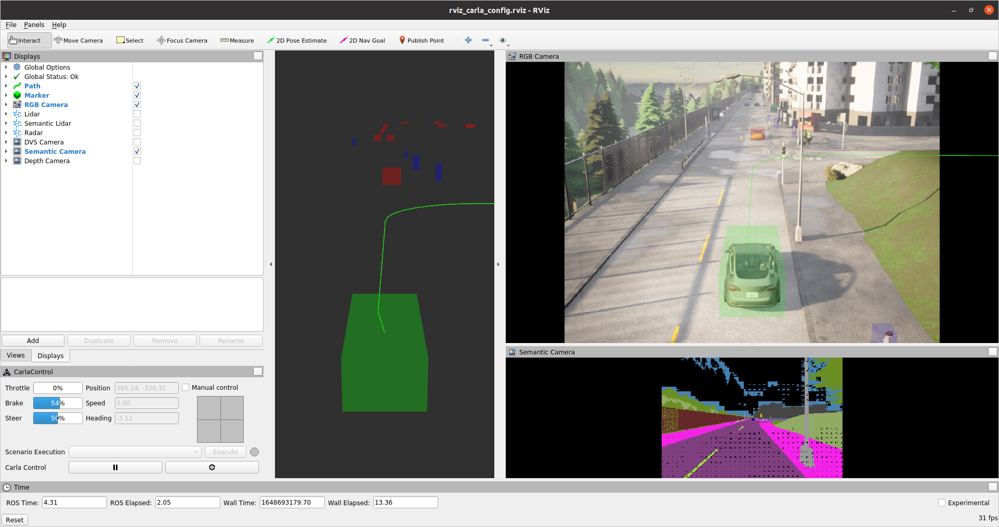

# Seminar Autonomous Driving (**P**raktikum **A**utonomes **F**ahren)

## About
This project is a competition-like challenge in the course Seminar Autonomous Driving
at the University of Augsburg.

Two teams of students (6-7 team members each) are creating their own self-driving car
software interacting with the CARLA simulation environment. At the end of the project,
there will be a live demo including a city and a racing mode where the cars of both
teams compete against each other.

The live demo will include the interaction with other cars / pedestrians, traffic lights.
Moreover there will be driving tests on a variety of maps to ensure that the self-driving
is not bound to a single map that was learnt by heart.



## Team Members
- Berghoff, Joshua
- Böll, Axel
- Mospan, Pavlo
- Stoljar, Johannes
- Sturm, Daniel
- Tröster, Marco

## Quick Start
0. Before you start, make sure that your PC runs a NVIDIA GPU supporting nvidia-docker.
1. First, set up your PC according to this
   [tutorial](https://github.com/ll7/paf21-1/wiki/Development-Machine-Setup-(NVIDIA-Docker)).
   It assists you at installing Docker with GPU support.
2. Clone this GitHub repository, e.g. use '*git clone https://github.com/ll7/paf21-1*'
3. Next, build all components required and run default scenario with "./launch.sh", 
4. See [docs](./components/README.md) if you are interested how to build manually. 

Running steps 2-3 could look something like this (see the README files for further information):

```sh
# clone the GitHub repo
git clone https://github.com/ll7/paf21-1
cd paf21-1

./launch.sh
# ... let the simulation do stuff ...
./shutdown.sh
```

## Repository Structure
This GitHub repository consists of following parts:

### Components
This section is all about the components required to launch a scenario such as the CARLA simulator,
the CARLA ROS bridge and not to mention also our own self-driving car software components.

As you might have already noticed, the technical part is heavily based on Docker / ROS, so each
component is provided as a Docker image, abstracting the ROS runtime in a self-contained manner.

See the [wiki](https://github.com/ll7/paf21-1/wiki/Architecture-Models) for further information.

### Scenarios
The scenarios section contains a set of scenario definitions. It's supposed the be self-contained,
meaning that each scenario can be run in an infrastructure-as-code like manner. This allows to run
the exact same scenario over and over again on various PCs.

## Architecture
The logical system overview provides insight in the intercommunication between our self-driving
components. It outlines the general dataflow from sensor information to actionable driving signals.

.drawio.png)

In contrast, the technical system overview focusses on the environment required to run the project's
self-driving simulation. We're heavily relying on Docker to abstract the ROS complexity away.
This brings several benefits such as enhanced team collaboration through simple dev machine setups,
GitHub CI/CD pipelines and most importantly more reliable, well defined components.

.drawio.png)

The original architecture used to be a pure Docker approach, theoretically capable of online reinforcement
trainings on large GPU clusters (we didn't have the resources to test). But running the CARLA simulator
inside a Docker container did actually cause considerable performance issues, so we decided to host the
simulator directly on the host machine and connect all network traffic to localhost via the Docker 'host' network.
In case a newer version fixes the performance issues, it might be beneficial to switch back to the pure
Docker approach as it allows for more flexibility.
